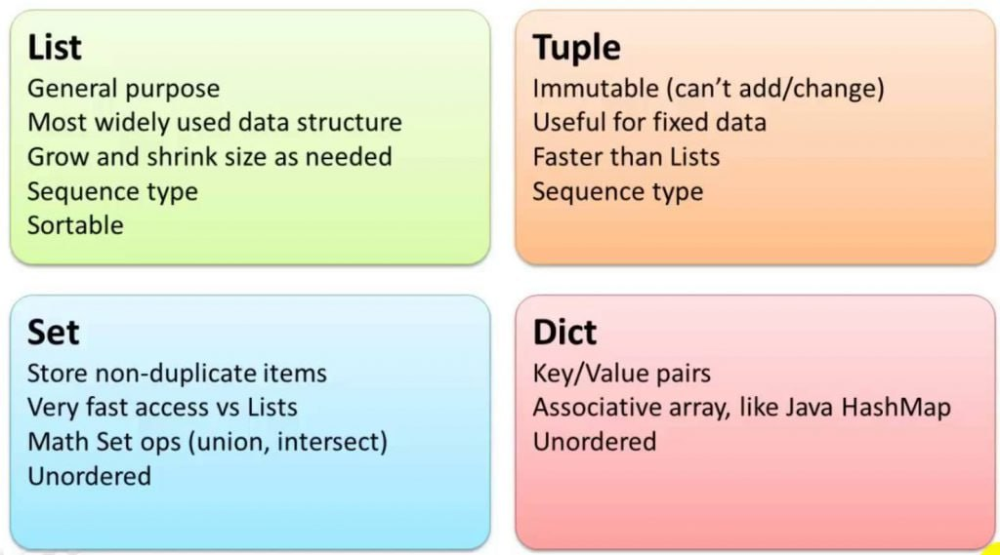

# Estruturas de Dados básicas

Nesta aula, vamos aprender sobre estruturas de dados básicas em Python:
* Listas;
* Conjuntos;
* Tupla;
* dicionários;
* Strings.

<p align="center">
  
</p>

## A. LISTAS (Lists)

Uma lista em Python é uma coleção ordenada de elementos, onde cada elemento é identificado por um índice.

### Criando uma Lista

```python
minha_lista = [1, 2, 3, 4, 5]
```

### Acessando Elementos

```python
print(minha_lista[0])  # Saída: 1
```

### Operações Básicas em Listas

* Adição de elementos: ```append()```, ```extend()```, ```insert()```
* Remoção de elementos: ```remove()```, ```pop()```, ```clear()```
* Atualização de elementos
* Concatenação: ```+```, ```*```
* Fatiamento: ```my_list[begin:end:step]```
* Pesquisa: ```in```
* Built-in functions: ```len()```, ```sum()```, ```min()```, ```max()```, ```sorted()```

### Exercícios

1. Crie uma lista com os nomes de cinco pessoas.
2. Adicione o seu próprio nome à lista.
3. Remova o nome da segundo pessoa da lista.
4. Imprima a lista de amigos em ordem alfabética.


## B. TUPLAS (Tuples)

Uma tupla em Python é uma coleção ordenada e imutável (não pode ser modificada) de elementos.

### Criando uma Tupla

```python
minha_tupla = (1, 2, 3, 4, 5)
```

### Acessando Elementos

```python
print(minha_tupla[0])  # Saída: 1
```

### Operações Básicas em Tuplas

* Concatenação: ```+```, ```*```
* Fatiamento: ```my_list[begin:end:step]```
* Pesquisa: ```in```

### Exemplo

Representar coordenadas geográficas, como latitude e longitude de diferentes locais.

```python
latlong = (40.7128, -74.0060)
```

### Exercícios

1. Crie uma tupla com os dias da semana.
2. Acesse o terceiro elemento da tupla.
3. Imprima a tupla completa na ordem reversa.


## C. CONJUNTOS (Sets)

Um conjunto em Python é uma coleção não ordenada e sem elementos duplicados.

### Criando um Conjunto

```python
meu_conjunto = {1, 2, 3, 4, 5}
```

Operações Básicas em Conjuntos

* Adição de elementos: ```add()```
* Remoção de elementos: ```remove()```, ```discard()```
* União, interseção, diferença: ```union()```, ```intersection()```, ```difference()```
* Verificação de pertencimento: ```in```

### Exemplo

Verificar se uma palavra faz parte de uma lista de palavras proibidas. 

```python
word = "pix"
spam_words = {"dinheiro", "urgente", "pix", "ganhador"}

print(word in spam_words)
```

### Exercícios

1. Crie dois conjuntos com cores diferentes.
2. Verifique se há alguma cor em comum entre os dois conjuntos.
3. Adicione uma cor ao primeiro conjunto.
4. Imprima a união dos dois conjuntos.


## D. DICÍONARIOS (Dictionaries)

Um dicionário em Python é uma coleção de elementos que são armazenados como pares chave-valor.
Criando um Dicionário

```python
meu_dicionario = {'a': 1, 'b': 2, 'c': 3}
```

### Acessando Elementos

```python
print(meu_dicionario['a'])  # Saída: 1
```

### Operações Básicas em Dicionários

* Adição de elementos 
* Remoção de elementos: ```pop()```, ```popitem()```, ```clear()```
* Atualização de elementos ```update()```
* Iteração: ```keys()```, ```values()```, ```items()```

### Exemplo

Armazenar informações detalhadas sobre um produto, como nome, preço e quantidade em estoque. Por exemplo:

```python
produto = {
    "nome": "Camiseta",
    "preco": 29.99,
    "estoque": 100
}
produto["estoque"] -= 1  # Atualiza o estoque após uma venda
print("Estoque restante:", produto["estoque"])  # Saída: 99
```

### Exercícios

1. Crie um dicionário com informações sobre um livro (título, autor, ano de publicação).
2. Imprima o título do livro.
3. Atualize o ano de publicação do livro.
4. Remova o autor do dicionário.

## E. STRINGS

Uma string em Python é uma sequência de caracteres.

### Criando uma String

```python
minha_string = "Olá, mundo!"
```

### Manipulação de Strings

* Concatenação: ```join()```
* Fatiamento 
* Métodos embutidos: ```split()```, ```join()```, ```find()```, ```replace()```

### Exemplo

Acho que sabemos aplicações para strings...

### Exercícios

1. Crie uma string com uma frase de sua escolha.
2. Imprima o comprimento da string.
3. Imprima a string em letras maiúsculas.
4. Imprima a string em letras minúsculas.
5. Conte o número de vezes que a letra 'a' aparece na string.
6. Crie duas strings com seu primeiro e último nome.
7. Concatene as duas strings para formar seu nome completo.
8. Separe seu nome completo em duas strings contendo apenas seu primeiro e último nome, respectivamente.
9. Junte as duas strings separadas com um espaço entre elas para formar seu nome completo novamente.
10. Crie uma string com uma frase que contenha a palavra 'Python'.
11. Substitua 'Python' por 'Java' na string.
12. Crie uma variável com seu nome e idade.
13. Use formatação de string para criar uma frase que inclua seu nome e idade.