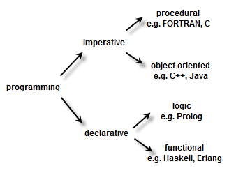

# Aula 1: C vs Python

Até agora, vocês estudaram fundamentos de programação utilizando a linguagem C.

Nesta disciplina, utilizaremos Python para retomar esses fundamentos e estudar novas formas de organizar e desenvolver programas.

Python foi escolhida porque:
* possui uma sintaxe geralmente mais concisa;
* permite utilizar diferentes paradigmas de programação;
* possui diversas bibliotecas para automação, computação científica e análise de dados.

A mudança de linguagem não significa começar novamente. Conceitos como variáveis, condições, repetições e funções continuam sendo utilizados, embora sejam escritos de maneiras diferentes.

## 1. Classificação das linguagens

As linguagens de programação podem ser classificadas de acordo com diferentes características e paradigmas.

<p align="center">
  
</p>

Essas classificações não são necessariamente exclusivas. Uma mesma linguagem pode oferecer suporte a diferentes estilos de programação.

> Diagramas de classificação representam uma visão simplificada. Na prática, as fronteiras entre os paradigmas nem sempre são rígidas.

### 1.1 Programação imperativa e declarativa

Uma maneira de classificar as linguagens considera como uma tarefa é expressa:

* **Imperativa:** enfatiza **como** uma tarefa deve ser realizada;
* **Declarativa:** enfatiza **qual resultado** deve ser obtido.

#### Programação imperativa

Na programação imperativa, descrevemos uma sequência de instruções que modifica o estado do programa.

```python
total = 0

for number in range(1, 6):
    total += number

print(total)
```

Nesse exemplo, descrevemos passo a passo como o valor de `total` deve ser calculado.

C e Python são frequentemente utilizadas de maneira imperativa.

#### Programação declarativa

Na programação declarativa, descrevemos principalmente o resultado desejado, deixando parte da estratégia de execução a cargo da linguagem ou do sistema.

```sql
SELECT name
FROM students
WHERE grade >= 6;
```

A consulta informa quais dados devem ser obtidos, enquanto o banco de dados decide como realizar a busca.

> A distinção entre programação imperativa e declarativa nem sempre é absoluta.

### 1.2 Paradigmas de programação

Também podemos classificar as linguagens de acordo com a forma como dados e operações são organizados.

Alguns paradigmas importantes são:

* **procedural:** organiza o programa principalmente em funções e procedimentos;
* **orientado a objetos:** organiza dados e comportamentos relacionados em objetos;
* **funcional:** utiliza funções como valores e como forma de transformar dados.

C é uma linguagem fortemente associada à programação procedural.

Python é uma linguagem **multiparadigma**, pois permite utilizar diferentes estilos:

* programação imperativa e procedural;
* programação orientada a objetos;
* programação funcional.

Esses paradigmas serão estudados com mais detalhes ao longo da disciplina.

## 2. Principais diferenças entre C e Python

C e Python podem ser utilizadas para resolver muitos dos mesmos problemas, mas apresentam diferenças de sintaxe, tipagem e forma de execução.

| Aspecto                       | C                            | Python                                  |
| ----------------------------- | ---------------------------- | --------------------------------------- |
| Delimitação de blocos         | Chaves `{}`                  | Indentação                              |
| Final das instruções          | Geralmente utiliza `;`       | Geralmente não utiliza `;`              |
| Tipagem                       | Estática                     | Dinâmica                                |
| Declaração de variáveis       | O tipo é declarado           | O tipo não é declarado junto à variável |
| Execução usual                | Compilação antes da execução | Execução por um interpretador           |
| Paradigma mais característico | Procedural                   | Multiparadigma                          |
| Quantidade de código          | Geralmente mais detalhado    | Geralmente mais conciso                 |

Essa tabela apresenta tendências gerais. As características podem variar de acordo com o programa e com as ferramentas utilizadas.

### 2.1 Blocos de código

Em C, utilizamos chaves para delimitar os blocos:

```c
if (grade >= 6) {
    printf("Aprovado\n");
} else {
    printf("Reprovado\n");
}
```

Em Python, os blocos são delimitados pela indentação:

```python
if grade >= 6:
    print("Aprovado")
else:
    print("Reprovado")
```

Em Python:

* não utilizamos chaves;
* a indentação faz parte da sintaxe;
* o caractere `:` indica o início de um bloco;
* normalmente não utilizamos `;` ao final das instruções.

> Em Python, a indentação não é apenas visual. Ela determina quais instruções pertencem a cada bloco.

### 2.2 Variáveis e tipos

Em C, uma variável é declarada com um tipo:

```c
int age = 20;
float grade = 8.5;
```

O tipo determina quais valores podem ser armazenados naquela variável.

```c
int value = 10;
value = "dez";  // Erro
```

Em Python, normalmente não declaramos o tipo junto ao nome da variável:

```python
age = 20
grade = 8.5
```

Uma variável pode ser associada a valores de tipos diferentes durante a execução:

```python
value = 10
value = "dez"
```

Podemos verificar o tipo de um valor utilizando `type`:

```python
value = 10
print(type(value))

value = "dez"
print(type(value))
```

Saída:

```text
<class 'int'>
<class 'str'>
```

Portanto, Python também possui tipos.

De maneira simplificada:

* C possui **tipagem estática**;
* Python possui **tipagem dinâmica**.

## 3. Forma de execução

De maneira simplificada:

* programas em C normalmente são compilados antes de serem executados;
* programas em Python normalmente são executados por meio de um interpretador.

### C

Considere um arquivo chamado `program.c`.

Primeiro, compilamos o programa:

```bash
gcc program.c -o program
```

Depois, executamos o arquivo gerado:

```bash
./program
```

Fluxo usual:

```text
Código em C
     ↓
 Compilação
     ↓
Executável
     ↓
  Execução
```

### Python

Considere um arquivo chamado `program.py`.

O programa pode ser executado diretamente com:

```bash
python program.py
```

Fluxo usual:

```text
Código em Python
       ↓
Interpretador Python
       ↓
    Execução
```

Por esse motivo, C é frequentemente descrita como uma linguagem compilada, enquanto Python é frequentemente descrita como uma linguagem interpretada.

> Essa classificação é uma simplificação. Neste momento, o mais importante é compreender a diferença entre os fluxos de uso mais comuns.

## 4. Comparação de um programa em C e Python

Vamos criar um programa que:

1. leia um número inteiro positivo (n);
2. calcule a soma dos números de (1) até (n);
3. imprima o resultado.

Por exemplo, para (n = 5):

[
1 + 2 + 3 + 4 + 5 = 15
]

### 4.1 Implementação em C

```c
#include <stdio.h>

int main(void) {
    int n;

    printf("Digite um número: ");
    scanf("%d", &n);

    int total = 0;

    for (int number = 1; number <= n; number++) {
        total += number;
    }

    printf("A soma é: %d\n", total);

    return 0;
}
```

Para compilar:

```bash
gcc program.c -o program
```

Para executar:

```bash
./program
```

### 4.2 Implementação equivalente em Python

```python
n = int(input("Digite um número: "))

total = 0

for number in range(1, n + 1):
    total += number

print("A soma é:", total)
```

Para executar:

```bash
python program.py
```

As duas implementações seguem o mesmo algoritmo:

1. ler o valor de `n`;
2. inicializar o acumulador `total`;
3. percorrer os números de `1` até `n`;
4. adicionar cada número ao acumulador;
5. imprimir o resultado.

A principal diferença está na forma como o algoritmo é escrito em cada linguagem.

Em C:

```c
for (int number = 1; number <= n; number++) {
    total += number;
}
```

Em Python:

```python
for number in range(1, n + 1):
    total += number
```

A expressão:

```python
range(1, n + 1)
```

representa os números de `1` até `n`.

O valor `n + 1` é utilizado porque o limite final de `range` não é incluído.

### 4.3 Uma versão mais concisa

Python também oferece a função `sum`:

```python
n = int(input("Digite um número: "))

total = sum(range(1, n + 1))

print("A soma é:", total)
```

As duas versões estão corretas.

A primeira descreve explicitamente o processo de acumulação:

```python
total = 0

for number in range(1, n + 1):
    total += number
```

A segunda utiliza uma função pronta da linguagem:

```python
total = sum(range(1, n + 1))
```

Ao longo da disciplina, aprenderemos a utilizar esses recursos sem perder a compreensão dos algoritmos.

## 5. Por que escolher uma ou outra?

A escolha de uma linguagem depende do problema que precisa ser resolvido.

### C

C é especialmente adequada quando são importantes:
* desempenho;
* controle sobre memória e recursos;
* proximidade com o hardware.

Por outro lado, normalmente exige mais detalhes de implementação e maior cuidado com memória e ponteiros.

### Python

Python é especialmente adequada quando são importantes:
* produtividade;
* legibilidade;
* rapidez no desenvolvimento;
* disponibilidade de bibliotecas;
* automação e análise de dados.

Por outro lado, geralmente oferece menos controle de baixo nível e alguns erros aparecem apenas durante a execução.

C e Python não são simplesmente linguagens concorrentes. Cada uma possui características adequadas a diferentes contextos.
