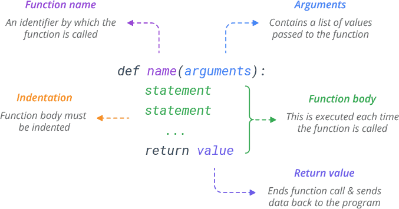

# Funções

## Introdução

Em Python, as funções desempenham um papel essencial, assim como em outras linguagens de programação.
Elas permitem a definição de blocos de código reutilizáveis e estruturados, projetados para realizar 
tarefas específicas de maneira eficiente e modular. O uso de funções oferece uma série de benefícios fundamentais:

* **Simplificação e Organização**:\
Agrupando operações relacionadas em funções, o código se torna mais organizado e legível, facilitando a compreensão e a manutenção futura.
* **Reutilização de Código**:\
A capacidade de invocar uma função em diferentes partes do código elimina a necessidade de repetir blocos de código, promovendo a eficiência e a consistência do programa.
* **Flexibilidade e Adaptação**:\
Encapsulando comportamentos em funções, é possível fazer alterações significativas no comportamento do programa sem modificar extensivamente o código principal.

## Sintaxe

Uma função tem a seguinte sintaxe em python:

<p align="center">
  
</p>

### Exemplo

Uma função tem a seguinte estrutura:
```python
def saudacao(nome):
    print("Olá,", nome)
saudacao("Maria")
```

## Tipos de argumentos / parâmetros
* **Argumentos**: São os valores passados para uma função durante sua chamada.
* **Parâmetros**: São as variáveis que recebem os valores dos argumentos dentro da função.


### Posicional
Os argumentos são associados aos parâmetros com base em sua posição.

```python
def exibir_divisao(num, den):
    print("Divsão: ", num / den)
exibir_divisao(4, 2)
```

### Palavra-chave
Os argumentos são associados aos parâmetros usando seus nomes.
```python
def exibir_divisao(num, den):
    print("Divsão: ", num / den)
exibir_divisao(num=4, den=2)
```

### Valor padrão
Os parâmetros podem ter valores padrão, que são usados quando nenhum valor é fornecido durante a chamada da função.

```python
def exibir_divisao(num, den=1):
    print("Divisão: ", num / den)
exibir_divisao(4)
```

### Observações

* Os argumentos posicionais devem vir antes dos argumentos por palavra-chave durante a chamada da função.
* A ordem dos parâmetros na definição da função é crucial para os argumentos posicionais, mas não para os argumentos por palavra-chave.

### Exercícios

1. Escreva uma função chamada ```exibir_info``` que recebe três parâmetros: ```nome```, ```idade``` e ```cidade```.
Esses parâmetros devem ter valores padrão de uma string vazia.
Dentro da função, imprima as informações no formato ```"Nome: [nome], Idade: [idade], Cidade: [cidade]"```.

2. Escreva uma função chamada ```cumprimentar_usuario``` que recebe um parâmetro ```nome```.
A função deve imprimir uma mensagem de saudação usando o nome fornecido.
Se nenhum nome for fornecido, ele deve ser padrão para "Usuário".

3. Escreva uma função chamada ```formatar_pedido``` que recebe parâmetros nomeados ```item```, ```quantidade``` e ```preco_por_unidade```, com valores padrão para ```quantidade``` $= 1$ e ```preco_por_unidade``` $= 0$. Dentro da função, calcule o preço total multiplicando a quantidade pelo preco_por_unidade. Exiba um texto que formate as informações do pedido no formato: ```"Pedido: [quantidade] x [item] a R$[preco_por_unidade] cada. Total: $[preco_total]"```.

4. Considere a seguinte função:

    ```python
    def trocar_palavra(palavra):
        palavra = "funcao"

    palavra = "algoritmo"
    trocar_palavra(palavra)
    print(palavra)
    ```

    a. Antes de executar o código, o que você espera que seja impresso após a chamada da função ```trocar_palavra```?\
    b. Qual é o impacto da chamada da função ```trocar_palavra``` na variavel ```palavra```?\
    c. Quais outros tipos de dados possuem um comportamento similar? e quais possuem um comportamento diferente?

## Lidando com argumentos variáveis (*args e **kwargs)
Às vezes, pode ser útil lidar com um número variável de argumentos em uma função. Para isso, podemos usar *args e **kwargs.

### *args
Permite passar um número variável de argumentos posicionais para uma função

```python
def exibir_soma(*args):
    total = 0
    for num in args:
        total += num
    print(total)
exibir_soma(1, 2, 3, 4, 5)
```

### **kwargs
Permite passar um número variável de argumentos por palavra-chave para uma função.

```python
def saudacao(**kwargs):
    for key in kwargs:
        print(f"{key} diz: {kwargs[key]}")

saudacao(Joao="Oi", Maria="Olá", Ana="Oi pessoal!")
```

### Observações

* Os argumentos posicionais e por palavra-chave ainda podem ser usados em conjunto com *args e **kwargs.
* *args e **kwargs não são palavras reservadas, mas convenções amplamente utilizadas.
* É importante manter a clareza ao usar esses recursos para evitar confusões na leitura e manutenção do código.

### Exercícios

1. Escreva uma função chamada ```calcular_media``` que recebe o nome do aluno e uma quantidade arbitrária de notas.
Dentro da função, calcule a média das notas passadas.
Exiba um texto que formate o resultado no formato: ```"O aluno [nome] teve média final [média]"```.

2. Escreva uma função chamada ```criar_perfil``` que recebe o nome de uma pessoa como primeiro argumento e argumentos de palavra-chave arbitrários representando vários aspectos de seu perfil (por exemplo, idade, cidade, ocupação, etc.).
Dentro da função, construa um dicionário onde as chaves são os nomes dos argumentos e os valores são os valores correspondentes passados para a função. 
Exiba este dicionário ao final da função.

## Retorno
Ao escrever funções em Python, é comum que elas retornem valores como resultado de suas operações.
O retorno de uma função é feito utilizando a instrução ```return```.

```python
def soma(a, b):
    resultado = a + b
    return resultado
print(soma(3, 5))
```

### Retorno de Múltiplos Valores
Uma função em Python também pode retornar múltiplos valores, separados por vírgula.

```python
def divide_e_resto(dividendo, divisor):
    quociente = dividendo // divisor
    resto = dividendo % divisor
    return quociente, resto

# Chamando a função e desempacotando os valores retornados
resultado, resto = divide_e_resto(10, 3)
print("Quociente:", resultado)
print("Resto:", resto)
```

### Retorno de Vazio (None)
Se uma função não especificar um valor de retorno utilizando a instrução ```return```, 
ela retorna automaticamente None.

```python
def funcao_sem_retorno():
    print("Esta função não tem retorno")
retorno = funcao_sem_retorno()
print(retorno) 
```

### Exercícios

1. Escreva uma função chamada ```calcular_quadrado``` que recebe um único parâmetro ```num```.
Dentro da função, calcule o quadrado de num e retorne-o.

2. Escreva uma função chamada ```calcular_propriedades_retângulo``` que recebe dois parâmetros: ```comprimento``` e ```largura```.
Dentro da função, calcule tanto a área quanto o perímetro do retângulo definido por estas dimensões.
Retorne estes valores como uma tupla (área, perímetro).

3. Escreva uma função chamada ```verificar_par_impar``` que recebe um parâmetro inteiro ```num```.
Dentro da função, verifique se o número é par ou ímpar.
Se for par, retorne a string "Par", caso contrário, retorne "Ímpar".

## Escopo de váriavel

O escopo de uma variável refere-se à parte do programa onde a variável é acessível.

### Exemplo:
```python
def exibir():
    x = 10  # Variável local
    print(x)

exibir()
print(x)  # Erro! x não está definido fora da função
```

### Variável Local e Global

* **Variáveis Locais**: São aquelas declaradas dentro de uma função e só são acessíveis dentro dela.
* **Variáveis Globais**: São aquelas declaradas fora de todas as funções e podem ser acessadas de qualquer lugar do programa.

```python
x = 10  # Variável global

def exibir():
    print(x)  # Variável global acessível dentro da função

exibir()
print(x)  # Variável global acessível fora da função
```

No exemplo acima, a variável ```x``` é uma variável global, pois é definida fora de qualquer função.
Portanto, pode ser acessada tanto dentro quanto fora da função ```exibir()```.

E, no caso abaixo, qual o comportamento você espera?

```python
x = 10  # Variável global

def exibir():
    x = 20  # Modificando a variável dentro da função
    print(x)

exibir()
print(x)  # Valor da variável global
```

E nesse?

```python
x = 10  # Variável global

def exibir():
    print(x)
    x = 20  # Modificando a variável dentro da função

exibir()
print(x)  # Valor da variável global
```

### A Palavra-chave global:

A palavra-chave ```global``` é usada para declarar que uma variável fora do escopo local da função deve ser tratada como global dentro da função.

```python
x = 10  # Variável global

def exibir():
    global x
    x = 20  # Modificando a variável global dentro da função
    print(x)

exibir()
print(x)  # Valor da variável global foi modificado pela função
```

### Exercícios

1. Escreva um programa que contenha uma função chamada ```contar_chamadas``` que incrementa um contador global a cada vez que é chamada.
Em seguida, chame a função várias vezes e imprima o valor do contador.

2. Considere a seguinte função em Python: 

    ```python
    def scope_test():
        def do_local():
            spam = "local spam"
            
        def do_global():
            global spam
            spam = "global spam"
            
        spam = "test spam"
        do_local()

        print("After local assignment:", spam)
        do_global()
        print("After global assignment:", spam)

    scope_test()
    print("In global scope:", spam)
    ```

    o que você espera que seja impresso após cada chamada de função e na linha final?

# Módulos e Pacotes

## O que são Módulos?

Até agora, nas aulas, nós criamos scripts simples contendo um conjunto pequeno de funções e variáveis a serem executados através de um interpretador Python.
Contudo, à medida que esses scripts ficam maiores, pode ser melhor dividi-los em vários arquivos separados para facilitar a manutenção.
Também pode ser interessante centralizar uma função útil em diferentes contextos em um único lugar, em vez de escrevê-la em vários programas diferentes.

Para suportar isso, Python desenvolveu uma maneira de colocar definições de funções e variáveis em um arquivo para serem usadas por outros scripts.
Esse arquivo é chamado de `módulo`.

## Por que usar Módulos?

* **Organização**: Mantém o código limpo e organizado.
* **Reutilização**: Permite reutilizar funções em diferentes partes de um programa ou em diferentes projetos.
* **Namespace**: Ajuda a evitar conflitos de nomes ao definir um escopo separado.

## Criando e usando módulos

### Criando

Um módulo em Python é simplesmente um arquivo com a extensão .py que contém definições de funções, variáveis e até mesmo outras estruturas de código, como classes.
Ou seja, nós podemos considerar que todos os scripts que desenvolvemos até agora são modulos que podem ser utilizados por outros scripts.

Por exemplo, vamos criar um módulo chamado `processamento.py``:

```python
# processamento.py

PI = 3.14159

def normalize_stddev(value, mean=0.0, stddev=1.0):
    #  Calcula a normalização de um único valor usando a média e o desvio padrão
    return (value - mean) / stddev

def normalize_minmax(value, data_min, data_max, min_val=0.0, max_val=1.0):
    # Primeiro normaliza o valor para o intervalo [0, 1]
    normalized_value = (value - data_min) / (data_max - data_min)
    # depois ajusta para o intervalo especificado por min_val e max_val
    return normalized_value * (max_val - min_val) + min_val
```

### Importando

Depois de criar um módulo, você pode importá-lo em outros arquivos Python usando a instrução `import`.

```python
# main.py

# Importar nosso modulo de processamento de texto
import processamento

print(processamento.normalize_minmax(10, -100, 100))
print(processamento.PI)
```

Se preferir, você também pode importar funções específicas de um módulo usando a sintaxe `from ... import ....``

```python
# main.py

# Importar funções especificas do nosso modulo de processamento de texto
from processamento import normalize_stddev, PI

print(normalize_minmax(10, -100, 100))
print(PI)
```

Ao executar o programa principal `main.py`, ele importará o módulo `processamento.py` e usará as funções e classes definidas nele.

## Namespace e Escopo

### Namespace

Um `namespace` em Python é um contexto onde nomes únicos são associados a objetos, uma especie de extensão do `escopo de variáveis` que vimos anteriormente.
Os módulos em Python ajudam a evitar conflitos de nomes, agrupando variáveis e funções em seus próprios namespaces.

Por exemplo, se tivermos dois módulos diferentes, cada um com uma função chamada soma, não haverá conflito de nomes, pois eles estarão em namespaces separados:

```python
# modulo1.py
def soma(a, b):
    return a + b
```

```python
# modulo2.py
def soma(x, y):
    return x + y
```

Ao importar esses módulos, podemos usá-los sem se preocupar com conflitos de nomes:

```python
import modulo1
import modulo2

print(modulo1.soma(2, 3))  # Saída: 5
print(modulo2.soma(2, 3))  # Saída: 5
```

### Escopo

O escopo de váriaveis dentro de um modulo segue as mesmas regras já vista em aulas anteriores.
Isto é, dentro de um módulo, as variáveis têm escopo global ou local.
* **Variáveis globais**: São definidas no nível do módulo e podem ser acessadas de qualquer lugar dentro do módulo.
* **Variáveis locais**: São definidas dentro de funções e só podem ser acessadas dentro da função onde foram definidas.

```python
# circulo.py

# Variável global
PI = 3.14159

def calcular_area(raio):
    # Variável local
    area = PI * raio ** 2
    return area

def calcular_circunferencia(raio):
    # Usando a variável global
    circunferencia = 2 * PI * raio
    return circunferencia
```

No caso, é importante ressaltar que a variável global `PI` também será acessivel por outros scripts ao importarmos esse modulo.

## \_\_name__ == \_\_main__

Em Python, o atributo `__name__` é uma variável especial que é automaticamente definida para o nome do módulo em que está sendo utilizado.
Quando um script Python é executado, o interpretador define `__name__` como `__main__` para o script que está sendo executado diretamente.

### Por que é importante?

O uso de \_\_name__ == "\_\_main__" permite que você escreva código que será executado apenas quando o arquivo .py for executado diretamente, e não quando importado como um módulo em outro script.
Isso é útil para separar o código que deve ser executado como um programa principal do código que é destinado a ser reutilizado em outros scripts.

### Exemplo

Considere o seguinte script main.py:

```python
def saudacao(nome):
    return f"Olá, {nome}!"

def main():
    print(saudacao("Alice"))

if __name__ == "__main__":
    main()
```

Neste exemplo, a função `main()` só será chamada se o script for executado diretamente.
Se o script for importado como um módulo em outro script, a função `main()` não será chamada automaticamente.

## Diretórios e Estrutura de Pacotes

Em Python, um `pacote` é uma pasta que contém múltiplos módulos e um arquivo especial chamado `__init__.py`.
Os pacotes são usados para organizar e estruturar grandes projetos em Python.
Eles ajudam a evitar conflitos de nomes e permitem uma hierarquia clara de módulos.

Por exemplo, considere a seguinte estrutura de diretórios:

```markdown
meu_pacote/
│
├── __init__.py
├── modulo1.py
└── modulo2.py
```

Aqui, `meu_pacote` é um pacote que contém dois módulos, `modulo1.py` e `modulo2.py`.

### \_\_init__.py

O arquivo `__init__.py` é um arquivo especial em pacotes Python. Ele pode estar vazio ou conter código de inicialização para o pacote.
Este arquivo é executado quando o pacote é importado e é usado para realizar qualquer configuração necessária para o pacote.

Por exemplo, o `__init__.py` pode definir variáveis globais, importar submódulos ou configurar o comportamento padrão do pacote.

```python
# __init__.py

print("Inicializando o pacote meu_pacote...")

# Definindo uma variável global no pacote
nome_pacote = "meu_pacote"
```

Ao importar o pacote meu_pacote, o código no `__init__.py` será executado.

## Localização de Pacotes no Sistema

### Path de Importação
O Python segue uma ordem específica ao procurar por módulos e pacotes. Esse processo é determinado pela variável de ambiente `sys.path`, que é uma lista de diretórios onde o interpretador Python procura por módulos.

### Locais Padrão de Busca
Os locais padrão de busca incluem:
- **Diretório atual**: O diretório em que o script em execução está localizado.
- **Diretórios do usuário**: Locais onde pacotes instalados pelo usuário estão localizados (como `~/Library/Python/3.9/lib/python/site-packages` no macOS).
- **Diretórios do Python instalados**: Locais onde os módulos padrão estão instalados (como `/usr/lib/python3.9` no Linux).

### Verificação do sys.path

Para verificar os diretórios atualmente incluídos em `sys.path`, você pode imprimir a variável:

```python
print(sys.path)
```

### Adicionando Locais Personalizados
Você também pode adicionar seus próprios diretórios à variável `sys.path` para que o Python os pesquise ao importar módulos. Isso pode ser útil ao desenvolver pacotes ou módulos personalizados que não estão instalados globalmente.

### Exemplo de Manipulação de `sys.path`
```python
import sys

# Adiciona um diretório personalizado ao path de importação
sys.path.append('/caminho/para/seu/pacote')

# Agora o Python procurará por módulos neste diretório ao importar
```

## Exercícios

### Módulo de Operações Matemáticas

Crie um módulo chamado operacoes_matematicas.py que contenha as seguintes funções:
* adicionar(a, b): Retorna a soma de a e b.
* subtrair(a, b): Retorna a subtração de b de a.
* multiplicar(a, b): Retorna a multiplicação de a por b.
* dividir(a, b): Retorna a divisão de a por b, tratando a divisão por zero.

Crie um script separado main.py que importe o módulo operacoes_matematicas e teste todas as funções com diferentes valores.
