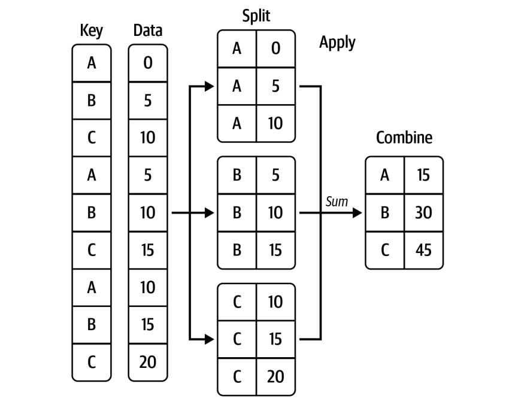

# Introdução ao Pandas: Agrupamento

## 1. Discretização de Variáveis Contínuas

### 1.1. O que é Discretização?

Discretização é o processo de converter variáveis contínuas (como idade ou renda) em categorias discretas, ou seja, em grupos definidos de valores. Isso é útil em várias situações, como criar faixas etárias ou categorias de renda para análise.

### 1.2. Métodos de Discretização

#### Binagem Uniforme (Fixed-Width Binning)

Neste método, dividimos uma variável contínua em intervalos de largura fixa. Para fazer isso, usamos a função `pd.cut()`.

```python
import pandas as pd

# Exemplo de dados: Idades de um grupo de pessoas
idades = [22, 35, 58, 45, 67, 30, 41, 18, 26, 34]

# Criando bins de largura fixa para as idades
bins = [18, 30, 40, 50, 60, 70]
categorias_idade = pd.cut(idades, bins)

print(categorias_idade)
```

#### Binagem Adaptativa (Quantile Binning)

Na binagem adaptativa, cada bin terá o mesmo número de observações. Isso é feito utilizando `pd.qcut()`.

```python
# Criando bins adaptativos para as idades
categorias_quantil = pd.qcut(idades, q=4)

print(categorias_quantil)
```

#### Regra de Sturges

A regra de Sturges é uma maneira simples de calcular o número de bins automaticamente com base no tamanho da amostra.
É dada pela fórmula:

$$ número\ de\ bins = 1 + \log_{2}(n)$$

Onde n é o número de observações.
No pandas, você pode especificar diretamente o número de bins, ou usar a regra para escolher um valor.

```python
import numpy as np

# Exemplo de dados: Renda
renda = np.random.normal(5000, 1500, 100)  # 100 valores de renda simulados

# Calculando o número de bins pela regra de Sturges
n_bins = int(1 + np.log2(len(renda)))

# Discretizando a renda
bins_renda = pd.cut(renda, bins=n_bins)

print(bins_renda)
```

**Observação**:
Existem outras maneiras de calcular automaticamente o número de bins, como o critério de Freedman-Diaconis, mas nesta aula vamos nos concentrar na regra de Sturges.

## 2. Agrupamento (GroupBy) no Pandas

O agrupamento no pandas é uma ferramenta poderosa para realizar análises baseadas em grupos de dados.
A função `groupby()` permite que você divida os dados em grupos, aplique uma função de agregação ou transformação a esses grupos e, por fim, combine os resultados.
Esse padrão é conhecido como "divisão-aplicação-combinação" e é amplamente utilizado em análises de dados.

### 2.1. Fundamentos do GroupBy

A operação groupby() agrupa os dados com base em uma ou mais colunas. Esses grupos são criados a partir de valores distintos presentes nas colunas selecionadas. Uma vez que os dados estão agrupados, você pode realizar várias operações de agregação, como soma, média, contagem, entre outras, em cada grupo.

A operação básica pode ser dividida em três etapas principais:

1. `Dividir os dados em grupos`:
Os dados são divididos com base nos valores de uma ou mais colunas.
2. `Aplicar uma função`:
Uma função de agregação ou transformação é aplicada a cada grupo (ex.: `mean()`, `sum()`, `count()`).
3. `Combinar os resultados`:
O resultado da operação é combinado em um novo objeto.

<p align="center">
  
</p>

### 2.2. Agrupamento por uma coluna

Quando agrupamos por uma coluna, o pandas divide os dados em subconjuntos, onde cada subconjunto contém as linhas que compartilham o mesmo valor na coluna de agrupamento. Em seguida, podemos aplicar funções de agregação para calcular estatísticas dentro de cada grupo.

Exemplo prático:

```python
import pandas as pd

# Exemplo de dados: Renda de pessoas em diferentes cidades
dados = {
    'cidade': ['A', 'B', 'A', 'B', 'C', 'C', 'A', 'B', 'C', 'A'],
    'renda': [2500, 4000, 3200, 3700, 2900, 4100, 2800, 3600, 3200, 3000]
}

df = pd.DataFrame(dados)

# Agrupando pela coluna 'cidade' e calculando a média de renda
media_renda = df.groupby('cidade')['renda'].mean()

print(media_renda)
```

**O que está acontecendo no código**:

1. `groupby('cidade')`:
Os dados são agrupados com base nos valores da coluna 'cidade'.
Isso cria três grupos: um para a cidade 'A', um para a cidade 'B', e outro para a cidade 'C'.
2. `['renda'].mean()`:
Dentro de cada grupo, a função `mean()` calcula a média da coluna 'renda'.
O resultado final é um Series com a média de renda para cada cidade.

**Resultado esperado**:

```css
cidade
A    2875.000000
B    3766.666667
C    3400.000000
Name: renda, dtype: float64
```

Neste exemplo, as rendas foram agrupadas por cidade e calculamos a média de cada grupo.

### 2.3. Agrupamento por múltiplas colunas

Você também pode agrupar os dados por mais de uma coluna.
Isso é útil quando você quer criar subgrupos baseados em várias categorias.

Por exemplo, se quisermos agrupar os dados por cidade e produto, podemos fazer o seguinte:

```python
# Exemplo: Dados de vendas por cidade e produto
vendas = {
    'cidade': ['A', 'B', 'A', 'B', 'C', 'C', 'A', 'B', 'C', 'A'],
    'produto': ['X', 'Y', 'X', 'Y', 'X', 'Z', 'Y', 'Z', 'X', 'Z'],
    'quantidade': [10, 20, 30, 40, 15, 25, 12, 22, 18, 15]
}

df_vendas = pd.DataFrame(vendas)

# Agrupando por cidade e produto e somando as quantidades
total_vendas = df_vendas.groupby(['cidade', 'produto'])['quantidade'].sum()

print(total_vendas)
```

**O que está acontecendo no código**:

* `groupby(['cidade', 'produto'])`:
Aqui estamos agrupando pelos valores das colunas 'cidade' e 'produto'.
O pandas criará subgrupos para cada combinação única de cidade e produto (por exemplo, cidade 'A' e produto 'X').
* `['quantidade'].sum()`:
Dentro de cada subgrupo, a função `sum()` calcula o total de vendas para aquele grupo.

**Resultado esperado**:

```css
cidade  produto
A       X          40
        Y          12
        Z          15
B       Y          60
        Z          22
C       X          33
        Z          25
Name: quantidade, dtype: int64
```

Aqui, agrupamos por cidade e produto, e somamos as quantidades vendidas de cada produto em cada cidade. Observe que a ordem das colunas de agrupamento faz diferença no resultado.
Agrupar por 'cidade' primeiro significa que o primeiro nível da hierarquia é a cidade, e dentro de cada cidade temos as vendas por produto.

### 2.4. Diferença entre Agrupar Colunas A, B e B, A

No exemplo anterior, agrupamos as colunas na ordem ['cidade', 'produto'].
Se trocássemos a ordem para ['produto', 'cidade'], o resultado seria agrupado primeiro por produto e depois por cidade.

```python
# Agrupando por produto e cidade e somando as quantidades
total_vendas_alterado = df_vendas.groupby(['produto', 'cidade'])['quantidade'].sum()

print(total_vendas_alterado)
```

**Resultado esperado**:

```css
produto  cidade
X        A          40
         C          33
Y        A          12
         B          60
Z        A          15
         B          22
         C          25
Name: quantidade, dtype: int64
```

Agora, o agrupamento é feito primeiro por produto e, dentro de cada produto, pelas cidades. 
Isso pode ser útil se você quiser analisar os dados de uma perspectiva diferente, como a quantidade vendida de cada produto em várias cidades.

#### Funções de Agregação Comuns

As funções de agregação mais usadas em um groupby() incluem:

* `mean()`: Calcula a média dos valores.
* `sum()`: Calcula a soma dos valores.
* `count()`: Conta o número de valores (não nulos).
* `min() / max()`: Calcula o valor mínimo/máximo de cada grupo.
* `std()`: Calcula o desvio padrão de cada grupo.

Exemplo de uso com múltiplas agregações:

```python
# Agrupando por cidade e calculando múltiplas estatísticas de renda
estatisticas_renda = df.groupby('cidade')['renda'].agg(['mean', 'sum', 'count'])

print(estatisticas_renda)
#             mean     sum  count
# cidade                           
# A       2875.000  11500.0      4
# B       3766.667  11300.0      3
# C       3400.000  10200.0      3
```

Aqui, usamos `agg()` para aplicar várias funções de agregação ao mesmo tempo.
Isso nos permite calcular, por exemplo, a média, soma e contagem de valores por grupo de uma vez só.

#### Funções Personalizadas com apply()

Se você precisar de uma operação de agregação mais complexa ou específica, pode usar a função `apply()` para aplicar uma função personalizada a cada grupo.
Veja um exemplo onde calculamos a variância de renda por cidade:

```python
# Exemplo de função personalizada
def calc_variancia(grupo):
    return grupo.var()

# Aplicando a função de variância aos grupos de cidades
variancia_renda = df.groupby('cidade')['renda'].apply(calc_variancia)

print(variancia_renda)
```

Nesse exemplo, criamos uma função que calcula a variância e aplicamos essa função a cada grupo de cidades usando apply().

### 2.5. Manipulando a Variável Resultante do GroupBy

Quando você utiliza o método `groupby()` no `pandas`, o resultado é um objeto do tipo `DataFrameGroupBy` ou `SeriesGroupBy`, dependendo se você está agrupando um `DataFrame` ou uma `Series`.
Esse objeto é uma referência aos grupos criados, e não contém diretamente os dados agregados ou transformados, até que você aplique uma função como `mean()`, `sum()`, ou `count()`.

Esse objeto `GroupBy` é bastante flexível e permite uma série de manipulações antes de aplicar funções de agregação ou transformação.
Vamos explorar algumas formas de interagir com esse objeto.

#### Verificando os Grupos Criados

Depois de criar um objeto `GroupBy`, você pode inspecionar os grupos com o método `.groups`. Esse método retorna um dicionário onde as chaves são os valores usados para agrupar e os valores são os índices das linhas que pertencem a cada grupo.

Exemplo:

```python
# Agrupando por cidade
agrupado = df.groupby('cidade')

# Verificando os grupos criados
print(agrupado.groups)
# {
#     'A': [0, 2, 6, 9],
#     'B': [1, 3, 7],
#     'C': [4, 5, 8]
# }
```

Esse dicionário mostra que, por exemplo, o grupo 'A' contém as linhas com os índices 0, 2, 6 e 9 do DataFrame original.

#### Acessando Dados de um Grupo Específico

Você pode acessar os dados de um grupo específico utilizando o método `.get_group()`, que retorna um subconjunto do DataFrame ou Series correspondente ao grupo.

```python
# Obtendo os dados do grupo 'A'
grupo_A = agrupado.get_group('A')

print(grupo_A)
#   cidade  renda
# 0      A   2500
# 2      A   3200
# 6      A   2800
# 9      A   3000
```

Neste exemplo, acessamos todas as linhas associadas à cidade 'A'.
Isso é útil se você quiser inspecionar ou trabalhar diretamente com um grupo específico antes de aplicar uma função de agregação.

#### Aplicando Funções Personalizadas com apply()

```python
# Função personalizada para calcular a diferença entre o valor máximo e mínimo de cada grupo
def calc_diferenca(grupo):
    return grupo.max() - grupo.min()

# Aplicando a função a cada grupo
diferenca_renda = agrupado['renda'].apply(calc_diferenca)

print(diferenca_renda)
# cidade
# A    700
# B    400
# C    1200
# Name: renda, dtype: int64
```

Aqui, a função `calc_diferenca()` calcula a diferença entre os valores máximo e mínimo de renda em cada grupo.
Usamos `apply()` para aplicar essa função a cada grupo do objeto GroupBy.

## 3. Exercícios

1. `Discretização e Visualização`: \
Discretize os valores de uma variável contínua, como altura ou peso, em bins e crie um gráfico de barras com as frequências de cada bin.

2. `Agrupamento e Estatísticas`: \
Use um dataset que contenha dados de clientes e realize agrupamentos para responder perguntas como:
    * "Qual é a média de compra por faixa etária?"
    * "Quantos clientes pertencem a cada categoria de gasto?"