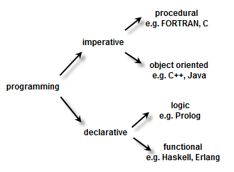

# C vs Python

## Classificação de Linguagens

Linguagens de programação podem ser divididas em relação a diversos aspectos da linguagem.

### Imperativa vs Declarativa

* **Imperativas**:
    Focam em "como" o programa deve ser executado, especificando passo a passo as instruções que o computador deve seguir.
    Exemplo: C, Python

* **Declarativas**:
    Focam em "o que" deve ser realizado, descrevendo o resultado desejado sem especificar os passos para alcançar esse resultado.
    Exemplo: SQL, HTML

### Procedural vs Orientada a Objetos

* **Procedural**:
    Baseadas em procedimentos ou funções, onde o código é organizado em sub-rotinas.
    Exemplo: C

* **Orientada a Objetos**:
    Baseadas em objetos, que são instâncias de classes, encapsulando dados e comportamentos.
    Exemplo: Python, Java

<p align="center">
  
</p>

## Linguagem compilada vs interpretada

No caso de Python e C, uma das principais diferenças entre eles é o fato de da primeira ser interpretada, 
enquanto a segunda ser compilada. 

### Compilada

Em linguagens compiladas, o código-fonte escrito pelo desenvolvedor é traduzido para código de máquina por meio de um compilador.
Este processo gera um arquivo executável que pode ser diretamente executado pelo sistema operacional da máquina alvo.

Processo de Compilação:
1. Escrita do Código-Fonte: O desenvolvedor escreve o programa em uma linguagem de alto nível (ex.: C).
2. Compilação: Um compilador traduz o código-fonte para código de máquina (binário) específico para a arquitetura do computador.
3. Execução: O arquivo executável gerado é executado diretamente pela CPU.

Exemplo de Linguagem Compilada: C, C++, Rust, Go

### Interpretada

Em linguagens interpretadas, o código-fonte é executado linha por linha por um interpretador, sem a necessidade de tradução prévia para código de máquina. O interpretador lê o código-fonte e o executa diretamente, convertendo-o para código de máquina durante a execução.

Processo de Interpretação:
1. Escrita do Código-Fonte: O desenvolvedor escreve o programa em uma linguagem de alto nível (ex.: Python).
2. Interpretação: Um interpretador lê e executa o código-fonte linha por linha.
3. Execução Imediata: O interpretador converte o código-fonte para código de máquina e executa cada instrução em tempo real.

Exemplo de Linguagem Interpretada: Python, JavaScript, Ruby, PHP

## Exemplo

Vamos criar um programa simples em ambas as linguagens que lê um número $n$ do usuário, soma todos os números de $1$ até $n$, e imprime o resultado.

### C (Compilada)

```c
#include <stdio.h>

int main(int argc, char *argv[]) {
    int n = atoi(argv[1]);

    int sum = 0;
    for (int i = 0; i < n; i++) {
        sum += i;
    }

    printf("The sum is: %d\n", sum);

    return 0;
}
```

Passo-a-passo:
1. Escrever o código em um editor de texto.
2. Compilar o código usando um compilador C (ex.: gcc program.c -o program).
3. Executar o arquivo gerado (./program).

### Python (Interpretada)

```python
import sys
n = int(sys.argv[1])
    
total_sum = 0
for i in range(n):
    total_sum += i

print("The sum is:", total_sum)
```

Passo-a-passo:
1. Escrever o código em um editor de texto.
2. Executar diretamente o código-fonte usando o interpretador Python (python program.py).

## Vantagens e Desvantagens

### C

Vantagens:
1. Alta performance e eficiência.
2. Controle preciso sobre recursos do sistema.
3. Ampla utilização em desenvolvimento de sistemas operacionais e aplicações que exigem alta performance.

Desvantagens:
1. Sintaxe complexa e propensa a erros.
2. Gerenciamento manual de memória.
3. Curva de aprendizado mais íngreme.

### Python

Vantagens:
1. Sintaxe simples e fácil de aprender.
2. Alta produtividade e rapidez no desenvolvimento.
3. Grande quantidade de bibliotecas e uma comunidade ativa.

Desvantagens:
1. Performance menor em comparação com linguagens compiladas.
2. Menos controle sobre recursos do sistema.
3. Pode não ser a melhor escolha para aplicações que exigem máxima performance.